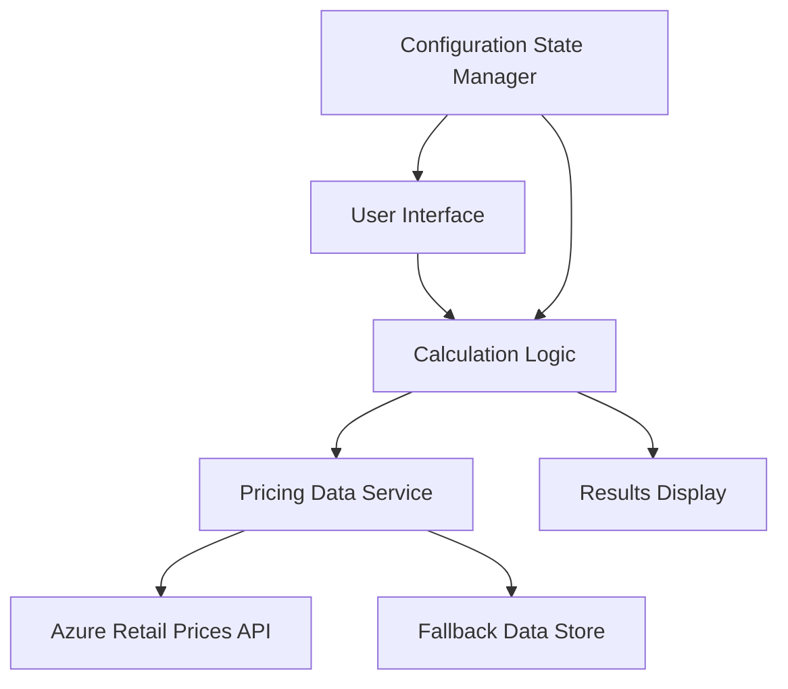
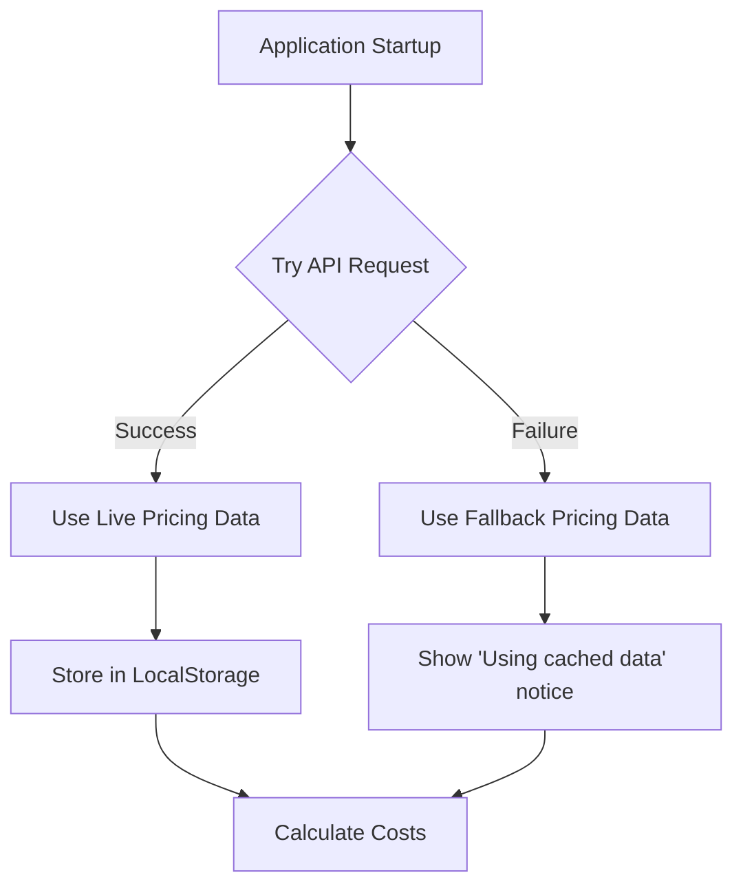
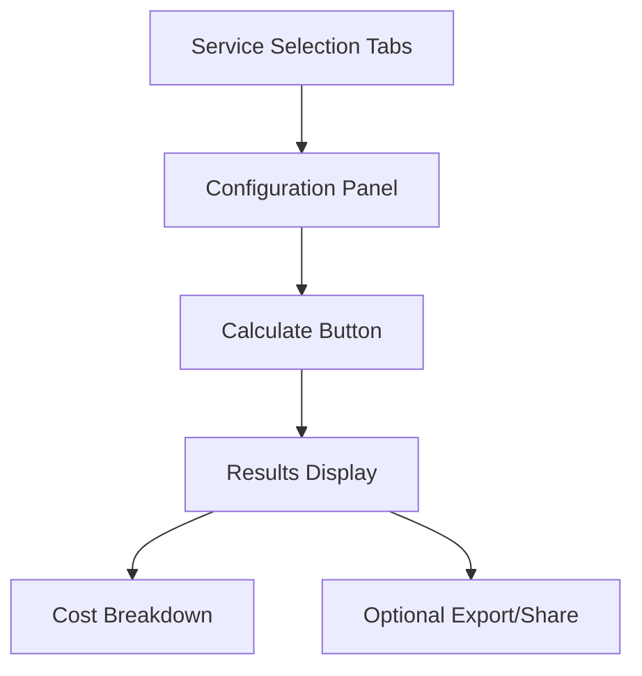

# Azure Cloud Cost Calculator - Detailed Project Plan

Based on your requirements, I've created a comprehensive plan for developing an Azure Cloud Cost Calculator web application that focuses on accurate pricing calculations for core compute services while allowing for local use and GitHub Pages deployment.

## 1. Project Overview

The Azure Cloud Cost Calculator will be a client-side web application that calculates estimated costs for Azure's core compute services:
- Virtual Machines (VMs)
- App Service
- Azure Functions
- Container Instances

The calculator will prioritize accuracy of calculations over UI complexity, use a hybrid approach for pricing data (Azure API with fallback to hardcoded data), and provide a basic interface suitable for personal use or demonstrations.

## 2. Technical Architecture



### Technology Stack
- **Frontend**: HTML, CSS, JavaScript (vanilla or with minimal framework)
- **Data Handling**: Fetch API, Local Storage
- **Deployment**: GitHub Pages

## 3. Features and Requirements

### Core Features:
1. **Service Selection**: Choose between VM, App Service, Functions, Container Instances
2. **Configuration Options**:
   - **VMs**: CPU cores, memory, storage, OS type, region
   - **App Service**: Tier, instance count, region
   - **Functions**: Execution count, memory allocation, execution time
   - **Container Instances**: Container groups, CPU, memory, uptime
3. **Cost Calculation**: Real-time calculation based on selected options
4. **Results Display**: Clear presentation of hourly, monthly, yearly costs
5. **Simple Comparison**: Compare costs between different configurations

## 4. Data Strategy



- **Primary Data Source**: Azure Retail Prices API
  - Filter for relevant services and regions
  - Cache results in localStorage

- **Fallback Data**: Hardcoded JSON with recent pricing
  - Include timestamp of last update
  - Display notice when using fallback data

## 5. UI/UX Design

A clean, functional interface with:
- Service selection tabs
- Configuration panel with appropriate inputs for each service
- Calculate button
- Results panel showing cost breakdown
- Responsive design for both desktop and mobile



## 6. Implementation Plan

### Phase 1: Project Setup (1-2 days)
- Create GitHub repository
- Set up basic HTML/CSS/JS structure
- Implement responsive layout
- Create service selection UI

### Phase 2: Data Layer (2-3 days)
- Implement Azure Retail Prices API integration
- Create fallback data structure
- Set up localStorage caching
- Build error handling and fallback logic

### Phase 3: Calculation Logic (3-4 days)
- Implement price calculation formulas for each service
- Create input validation
- Set up real-time calculation updates

### Phase 4: UI Refinement and Testing (2-3 days)
- Polish UI components and styling
- Test calculations against actual Azure pricing
- Add usage instructions and tooltips
- Ensure responsive behavior

### Phase 5: Deployment (1 day)
- Configure for GitHub Pages deployment
- Create documentation
- Test cross-browser compatibility

## 7. Project Structure

```
azure-cost-calculator/
├── index.html                  # Main HTML file
├── css/
│   ├── main.css                # Main styles
│   └── responsive.css          # Responsive styles
├── js/
│   ├── app.js                  # Main application logic
│   ├── calculator.js           # Calculation engine
│   ├── data-service.js         # API and data handling
│   ├── ui-controller.js        # UI interactions
│   └── services/               # Service-specific logic
│       ├── vm-calculator.js
│       ├── app-service.js
│       ├── functions.js
│       └── containers.js
├── data/
│   └── fallback-pricing.js     # Fallback pricing data
└── assets/
    └── images/                 # Icons and images
```

## 8. Testing Approach

- **Calculation Validation**: Compare with official Azure pricing calculator
- **API Fallback Testing**: Test with and without API access
- **Browser Compatibility**: Test on major browsers
- **Responsive Testing**: Test on various device sizes

## 9. Future Enhancement Possibilities

- Additional Azure services
- Saved configurations
- Export functionality (PDF/CSV)
- Side-by-side configuration comparison
- Integration with actual Azure resource usage